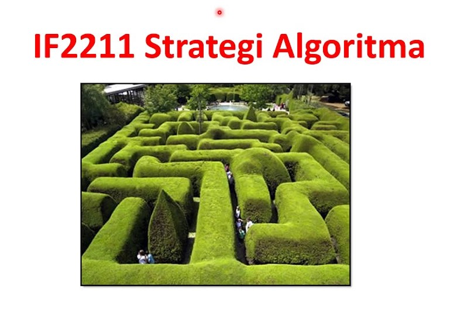

<h1 align=center>
🎴 STIMArt 🎴 
</h1>

> Task Seleksi Lab IRK created by M. Rifqi Farhansyah

<div align=center>

<br>
  <b>Fig 1.</b> Banner andalan PPT Pak Rin
<br>
</div>
<br>

```diff
- versi 1 Juli 2024
+ versi 2 Juli 2024
```

## 💡 Latar Belakang

STIMA (_STrategI algoritMA_) merupakan salah satu mata kuliah di bawah naungan Lab IRK yang paling disukai oleh para mahasiswa, khususnya mahasiswa yang mengikuti seleksi Lab IRK ini. Rasanya aneh jika para pejuang Lab IRK yang amat menyukai STIMA tidak menguasai seluruh topik yang diajarkan di mata kuliah ini. Oleh karena itu, kami akan memfasilitasi kalian untuk mengungkapkan besarnya rasa cinta yang kalian miliki pada mata kuliah STIMA melalui pembuatan sebuah aplikasi yang memanfaatkan hampir seluruh algoritma dalam mata kuliah ini. **Sambutlah**, STIMArt (Aplikasi _paint_ ~~sederhana~~ yang memanfaatkan hampir seluruh algoritma dalam mata kuliah _STrategI algoritMA_).

## 📝 Spesifikasi Tugas

Pada tugas ini Anda akan diminta untuk mengimplementasikan sebuah aplikasi _paint_ sederhana dengan tiap fitur dalam aplikasi tersebut merupakan penerapan topik-topik pada mata kuliah strategi algoritma. Para peserta seleksi telah dianggap menyelesaikan tugas ini apabila seluruh spesifikasi wajib + minimal 3 poin spesifikasi lanjutan telah diimplementasikan. 

Berikut merupakan detail untuk spesifikasi wajib dan lanjutan:

### Spesifikasi Wajib (XXXX Poin)

STIMArt harus dibuat <b>berbasis GUI</b>. Bahasa dan _techstack_ yang hendak digunakan dibebaskan kepada para mahasiswa (tingkat kesulitan _techstack_ yang dipilih akan mempengaruhi tingkat subjektifitas penilaian). Aplikasi STIMArt harus mengandung beberapa fitur wajib di bawah ini:

1. Toolbar yang dapat digunakan untuk memilih aksi tertentu (aksi pada spesifikasi wajib, lanjutan, ataupun tambahan fitur kreatifitas).
2. Tiap aksi yang ada dapat dilakukan dengan menekan _shortcut_ (misal: huruf tertentu pada _keyboard_) dan _context menu_ atau _toolbar_ (sesuaikan penggunaan ketiganya).
3. Pengguna dapat menggambar, menghapus, serta memberi warna yang telah dipilih pada canvas. Pengguna juga dapat melakukan proses _selection_ pada subset dari objek-objek dalam canvas untuk diubah warnanya, dihapus, diduplikat, atau dipindahkan posisinya.
4. Pengguna dapat mengunggah gambar-gambar (*.jpg, *.png, *.jpeg) serta melakukan aksi _drag and drop_ pada gambar yang telah di-_select_ terlebih dahulu.
5. Untuk tiap gambar dapat diubah _z-index_ nya terhadap gambar lain dengan menggunakan fitur _upward_ or _backward_.
6. Buatlah fitur-fitur berikut:
    - _Bucket Filling_ dengan menggunakan algoritma BFS dan DFS. Fitur ini akan melakukan pewarnaan otomatis terhadap objek dengan _border_ tertentu pada canvas. Pengguna dapat merubah pilihan algoritma yang hendak digunakan (BFS atau DFS).
    - _Image Blurring_ dengan mennggunakan algoritma Divide and Conquer. Gambar yang telah diupload dapat dibuat menjadi _blur_ menggunakan fitur ini. Pengguna dapat menentukan skala yang hendak digunakan.
    - _Color Depth Reducing_ dengan menggunakan algoritma Decrease and Conquer. Fitur ini dapat digunakan untuk menurunkan kedalaman warna dari sebuah gambar. Pengguna dapat menentukan skala yang hendak digunakan.
    - _Image Segmentation_ dengan menggunakan algoritma Branch and Bound. Fitur ini akan memisah-misahkan sebuah gambar menjadi 2 gambar baru berdasarkan sebuah indikator pemisah tertentu (misal: warna).
    - _Undo Redo_ dengan menggunakan algoritma Backtracking. Fitur ini dapat digunakan pengguna untuk melakukan _undo_ atau _redo_ pada aksi tertentu.
7. Buatlah readme pada masing-masing repository yang menjelaskan:
    - Deskripsi Program
    - Teknologi dan Framework
    - Penjelasan algoritma untuk tiap fungsionalitas
    - Hasil percobaan dalam bentuk GIF
    - Cara menjalankan aplikasi
    - Referensi Belajar

### Spesifikasi Lanjutan (XXXX Poin)

Anda diperkenankan untuk memilih 3 dari 5 spesifikasi lanjutan dibawah ini untuk diimplementasikan (lebih dari 3 akan dianggap sebagai bonus). Berikut ini adalah pilihan spesifikasi lanjutan yang dapat diimplementasikan:

1. _Seam Carving_ dengan menggunakan algoritma Dynamic Programming. Fitur ini dapat digunakan untuk me-_resize_ sebuah gambar dengan mengurangi atau menambah pixel dari gambar tersebut untuk menjaga keotentikan gambar itu sendiri.
2. _Image Denoising_ dengan menggunakan algoritma Dynamic Programming. Fitur ini dapat digunakan untuk mengurangi _noise_ pada sebuah gambar.
3. _Permutations and Combinations_ dengan menggunakan algoritma Brute force. Fitur ini dapat digunakan untuk memberikan saran _color palette_ pada pengguna berdasarkan seluruh warna yang ada di canvas.
4. _Object Placement_ dengan menggunakan algoritma Greedy. Fitur ini dapat digunakan untuk menentukan _placement_ terbaik dari tiap objek dalam canvas dengan mempertimbangkan metriks evaluasi tertentu (misal: _minimal overlap_, _maximal coverage_, dll).
5. _Pattern Replacement_ dengan menggunakan algoritma String Matching. Fitur ini dapat digunakan untuk mengganti _pattern_ warna tertentu dari sebuah objek dalam _canvas_.

## 📂 Pengerjaan dan Pengumpulan

> [!IMPORTANT]
> IQRA`

1. Buatlah repositori **private** pada github masing-masing dan invite `rifqifarhansyah` dalam repositori tersebut.
2. Berkas yang dikumpulkan berupa **link rilis tag ke repositori github** yang telah dibuat dengan ketentuan sebagai berikut.
    - Memberikan tag `vn` pada commit terakhir Anda setiap kali ingin melakukan submisi dengan `n` adalah jumlah submisi yang telah dilakukan. (contoh: `v1` untuk submisi pertama).
    - **Tidak menggunakan *url shortener*** (bit.ly, shortlink, atau yang lain) saat melakukan pengumpulan *task*.
    - Anda dapat melakukan rilis dengan panduan [berikut](https://docs.github.com/en/repositories/releasing-projects-on-github/managing-releases-in-a-repository).
3. **Lakukan submisi** pada website seleksi IRK dengan menggunakan akun std.stei.itb.ac.id, **lakukan konfirmasi** ke LINE `@aremaniak123`, dan **jadwalkan demo** dengan cara yang sama. Lakukan hal yang sama jika membuat rilis yang baru.
4. Jika terdapat pertanyaan dapat menghubungi LINE `@aremaniak123`.

## 📌 Penilaian

> [!CAUTION]
> Asisten berhak tidak memberikan nilai apabila diketahui terdapat pelanggaran

Penilaian akan didasarkan pada kesesuaian hasil implementasi dengan spesifikasi di atas.

| Posisi      | Poin Seleksi |
| ----------- | ------------ |
| 1           | 2300         |
| 2           | 2185         |
| 3           | 2070         |
| 4           | 1955         |
| 5 - dst     | 1840         |

## 📚 Referensi

- [Google Scholar](https://scholar.google.com/) :v
- [Google](https://www.google.com/) :V :V :V

<hr>

<h3 align="center">
  Semangat, Good Luck, dan FREE PALESTINE 🍉🍉🍉
</h3>
